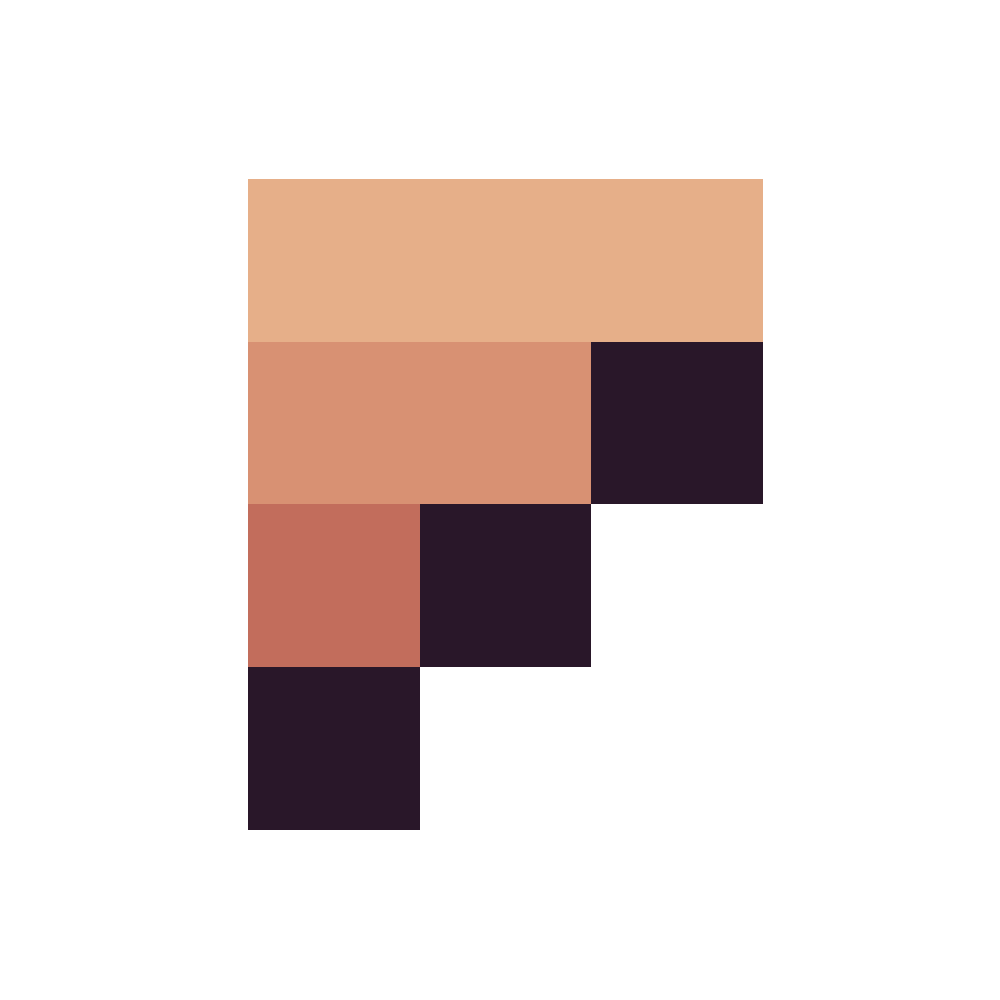

<p align="center">
  
</p>


# 
**Fizzy** is a cross-platform open-source pixel art editor and animation editor written in [Zig](https://github.com/ziglang/zig).

### Downloads are available [here](https://fizzyed.it)

#### Check out the [user guide](https://github.com/foxnne/fizzy/wiki/User-Guide)!


[](https://ko-fi.com/R5R4LL2PJ)

## Currently supported features
- [x] Typical pixel art operations. (draw, erase, dropper, bucket, selection, transformation, etc)
- [x] Tabs and splits, drag and drop to reorder and reconfigure
- [x] File explorer with search and drag and drop.
- [ ] Create animations and preview easily, edit directly on the preview.
- [ ] View previous and next frames of the animation.
- [ ] Set sprite origins for drawing sprites easily in game frameworks.
- [ ] Import and slice existing .png spritesheets.
- [x] Intuitive and customizeable user interface.
- [x] Sprite packing
- [ ] Theming
- [ ] Automatic packing and export on file save
- [x] Also a zig library offering modules for handling assets
- [ ] Export animations as .gifs 

## User Interface
- The user interface is driven by [DVUI](https://github.com/david-vanderson/dvui).
- The general layout takes many ideas from VSCode or IDE's, as well as general project setup using folders.

## Compilation
- [Linux] Ensure `gtk+3-devel` or similar is installed (for native file dialogs).
- Install zig 0.16.0.
- Clone fizzy.
- Build.
    - ```git clone https://github.com/foxnne/fizzy.git```
    - ```cd fizzy```
    - ```zig build run```

## Credits
- [David Vanderson](https://github.com/david-vanderson) for all the help and [DVUI](https://github.com/david-vanderson/dvui).
- [emidoots](https://github.com/emidoots) for all the help and [mach](https://github.com/hexops/mach).
- [michal-z](https://github.com/michal-z) for all the help and [zig-gamedev](https://github.com/michal-z/zig-gamedev).
- [prime31](https://github.com/prime31) for all the help.
- Any and all contributors


     
